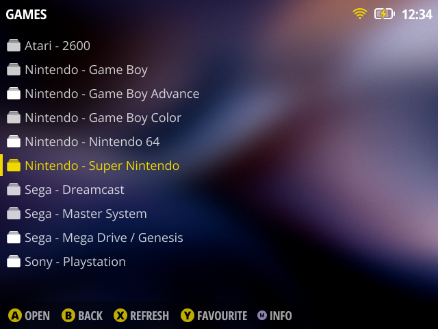
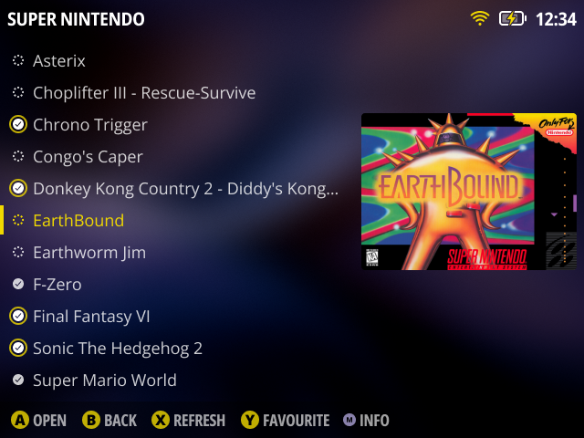
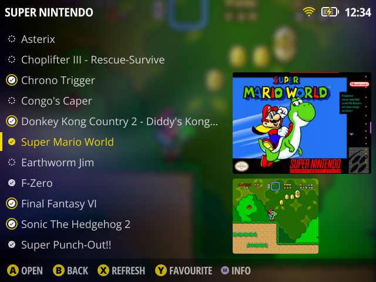

# ✨ Aura - muOS Theme

**Aura** is a sleek and minimalist theme designed to elevate your [muOS](https://muos.dev) experience. Featuring a blurred background image, refined iconography and a nice typography, it brings a modern touch to your handheld gaming world.

## Installation

1. Download `Aura.zip` from the [releases page](https://github.com/nagueva/aura/releases).
2. Move the `.zip` file to your device within the `MUOS/theme` folder.
4. Activate the theme in muOS settings.
5. Enjoy!

## Reporting Issues

If you encounter any issues or have suggestions for improvements, please [open an issue](https://github.com/nagueva/aura/issues).

## Supported screen sizes
- 640x480
- 720x480
- 720x576
- 720x720
- 1280x720

## Tested devices

- Anbernic RG40XX V (640x480)

## Screenshots

<table>
    <tr>
        <td></td>
        <td></td>
    </tr>
    <tr>
        <td></td>
        <td></td>
    </tr>
</table>

## Credits

**Fonts**
- [Open Sans](https://fonts.google.com/specimen/Open+Sans) from Google Fonts
- [Noto Sans](https://fonts.google.com/specimen/Noto+Sans) from Google Fonts

**Background image**
- Aurora wallpaper from [Autumn Gradients](https://basicappleguy.com/basicappleblog/autumn-gradients) (sep/2023) by icAppleGuy](https://basicappleguy.com/).

**Icon sets**
- **UI icons**: [Ionicons](https://ionic.io/ionicons)
- **Controller icons**: [VECTOGRAM Icon Set](https://thenounproject.com/browse/collection-icon/vectogram-6394/) by [Mark Davis](http://themizarkshow.com/).

**Icons**
- History icon by [Adrien Coquet](https://www.behance.net/coquet_adrien) from [Noun Project](https://thenounproject.com/icon/ory-2496446/) (CC BY 3.0)
- Applications icon by [Ade Nur Hidayat](https://dribbble.com/adenurhidayat) from [Noun Project](https://thenounproject.com/icon/applications-3955850/) (CC BY 3.0)
- Ports icon by [AbtoCreative](https://www.behance.net/AbtoCreative) from [Noun Project](https://thenounproject.com/icon/ports-5252885/) (CC BY 3.0)

## License

**Aura** is released under the [MIT License](./LICENSE), meaning it's free to use and modify. However, if a modified version is shared/distributed, it must include a clear reference to this original version.
